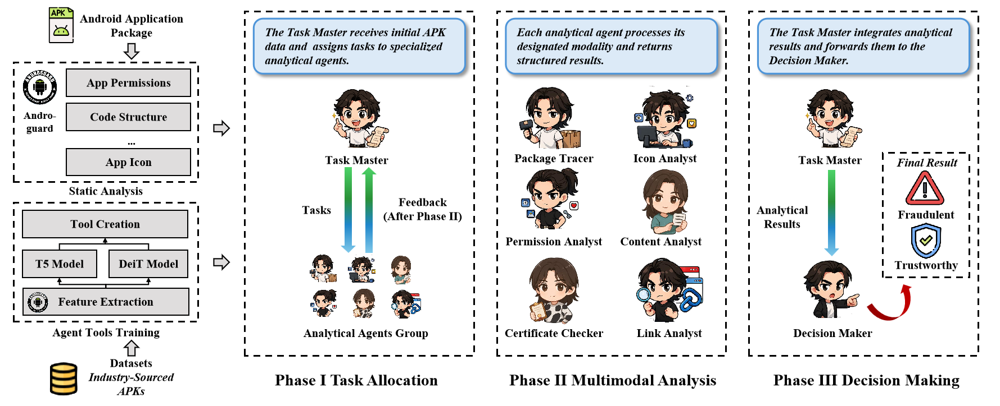

# AgentDroid

**AgentDroid** is a multi-agent detection tool for real-world fraudulent Android applications.

This tool is developed based on Large Language Models and the static analysis tool *Androguard*.

A brief introduction video has been uploaded to [YouTube](https://youtu.be/YOM9Ex-nBts).

## Workflow of AgentDroid



The workflow of **AgentDroid** is illustrated in the above figure.
Firstly, users upload an APK file through the frontend. Then AgentDroid performs the following steps: It statically analyzes the APK to extract metadata, icons, permissions, and source code. The extracted information is processed by eight specialized agents, each focusing on a specific analysis task. These agents perform reasoning based on prompt templates and collaborate under the control of a Task Master. Finally, the Decision Maker agent generates the fraud prediction result, including the fraud type and risk level.

The complete dataset (about 11 GB) is avaliable at [https://caiyun.139.com/w/i/2oRhigu9XsAa5](https://caiyun.139.com/w/i/2oRhigu9XsAa5). Password: c6oh.

## Package Requirements

AgentDroid requires:

* Python 3.11+
* Node.js 16+
* pip
* npm
* androguard
* flask
* flask-cors
* langchain-openai
* langchain
* langgraph
* transformers
* datasets
* evaluate
* accelerate[torch]
* tqdm
* opencv-python
* pyzbar
* scikit-learn
* pandas
* SentencePiece
* protobuf
* langchain-community
* pyaxmlparser
* flask[async]
* quart

## Usage of AgentDroid

We provide a command-line and browser-based interface for users to interact with AgentDroid. The details of arguments and usage are shown below.

### 1. Clone the repository

```bash
git clone git@github.com:Wwstarry/LLM4Fraud.git
cd LLM4Fraud
```

### 2. Install dependencies

```bash
cd back
pip install -r requirements.txt

cd ../front
npm install
```

### 3. Run the tool

First start the backend server:

```bash
cd back
python app.py
```

Then start the frontend interface:

```bash
cd ../front
npm run dev
```

### 4. Access the interface

Open your browser and go to: [http://localhost:5000](http://localhost:5000)

Login with the following credentials:

```
Username: 123
Password: 123
```

After logging in, you can upload APK files, and AgentDroid will automatically run static analysis and fraud detection using the multi-agent framework.

The detection results and explanations will be displayed in the result page.

